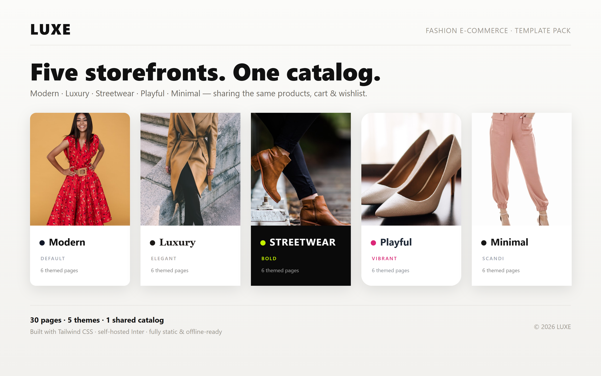

# LUXE — Static Fashion Storefront



A fully static fashion e-commerce site (Tailwind CSS + vanilla JS) shipped as
**five themed storefronts** that share one catalog, cart, and wishlist. Cart and
wishlist persist in `localStorage`. Product images and the Inter font are
self-hosted, so the site works offline once built.

> **Serve from the site root.** Pages use root-relative asset paths
> (`/dist`, `/js`, `/images`), so run a server at the project root (see "Run
> locally"). Opening files via `file://` will not resolve assets.

## Structure
- `index.html` — **landing page**: a gallery that links to all five templates.
- `templates/<theme>/` — each theme is a complete store with `index`, `shop`,
  `product`, `cart`, `checkout`, `wishlist`. Themes: `modern`, `luxury`,
  `streetwear`, `playful`, `minimal`.
- `admin.html` — product/pricing admin (root).

Each page sets a `theme-<name>` class on `<body>`; the theme tokens and `.t-*`
component classes in `src/input.css` reskin everything (fonts, colors, radius,
buttons, cards, inputs) consistently. Home pages are bespoke per theme; inner
pages share one layout that is reskinned by the theme.

## Project layout
```
index.html               landing / template gallery
templates/<theme>/*.html generated themed pages  (do not hand-edit)
scripts/build-templates.js  generator that emits templates/**
js/products.js           product catalog (image paths are root-relative)
js/app.js                cart + wishlist + helpers + themed product card
js/page-*.js             shared per-page behavior (shop/product/cart/checkout/wishlist/home)
src/input.css            Tailwind entry + @font-face + theme tokens + .t-* components
dist/styles.css          compiled, minified CSS  (build output)
fonts/                   self-hosted Inter woff2 (400/500/600/700)
images/                  product, hero, and category photos
```

> The themed pages under `templates/**` are **generated**. Edit the generator
> (`scripts/build-templates.js`), the shared `js/page-*.js`, or `src/input.css`
> tokens — then rebuild. Don't hand-edit the generated HTML; it will be overwritten.

## Licenses & credits

See [CREDITS.md](CREDITS.md) for asset licenses (Tailwind — MIT; Inter — SIL OFL
1.1, bundled in `fonts/`; images — Unsplash License) and the **residual legal
risks to review before going live** (people's likenesses in some photos, the
placeholder "LUXE" brand name, demo policies, and the non-functional payment
form). Product images were chosen/replaced to avoid third-party brand logos.

## Build

`npm run build` does two steps: (1) runs the generator to (re)write
`templates/**`, then (2) compiles `src/input.css` → `dist/styles.css` (Tailwind
scans `templates/**` so all theme classes are included). Rebuild after editing
the generator, page scripts, theme tokens, or any class names:

```bash
npm install      # first time only
npm run build    # one-off minified build
npm run watch    # rebuild on change during development
```

> Tailwind scans `*.html` and `js/**/*.js` (see `tailwind.config.js`), so classes
> generated dynamically in `js/app.js` are included in the build.

## Admin (`admin.html`)

Visual tool to add/edit/delete products and manage pricing. Edits save to a
`localStorage` working copy (live-previews on the store); **Export products.js**
downloads a drop-in replacement for `js/products.js` to publish for everyone.

It's behind a **client-side password gate** (`js/admin-auth.js`).

> ⚠️ The gate is **obfuscation, not security** — the page and catalog are still
> downloadable and the gate can be bypassed. For real protection, serve
> `admin.html` behind server-side auth (HTTP Basic Auth, Netlify Identity,
> Cloudflare Access, …).

- **Default password:** `luxe-admin` — change it.
- **To change it:** open `admin.html`, open the browser console, run
  `await luxeHash('your-new-password')`, and paste the printed hash into
  `ADMIN_PASS_HASH` in `js/admin-auth.js`. (The password is stored only as a
  SHA-256 hash, never in plaintext.)
- Unlock persists for the browser session; "Log out" clears it.
- Requires a secure context for hashing — serve over `http://localhost` or
  `https` (not `file://`).

## Run locally
Open `index.html` directly, or serve the folder (recommended, for clean paths):

```bash
python -m http.server 8000   # then visit http://localhost:8000
```
